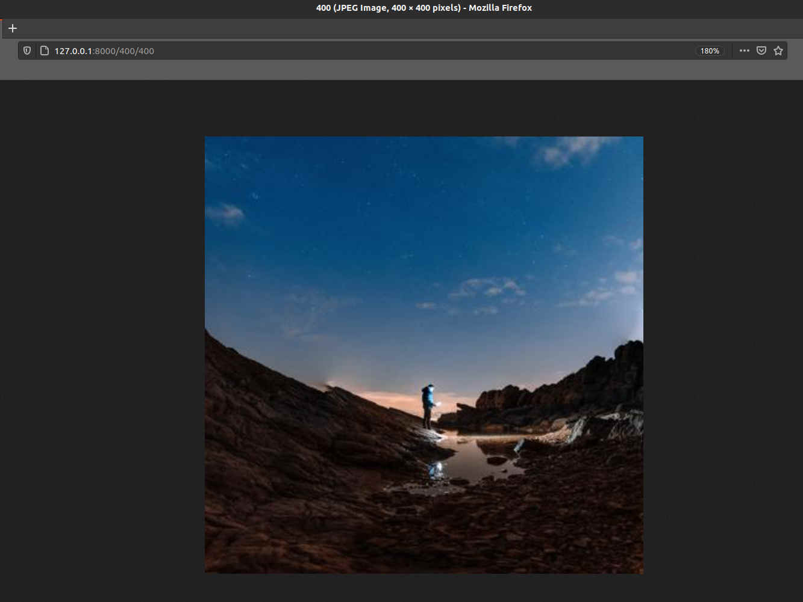

# lorem_images

Add your desired image size (width & height) after base URL, and you'll get a random image.

```
127.0.0.1:8000/400/400

```

resultant image in response 




## syntax 

```
127.0.0.1:8000/width/height

```

## installation 


```python 
pip3 install -r requirements.txt
```

## Tested system spec 

Operating system : Ubuntu 20.04

Python : 3.8.5


